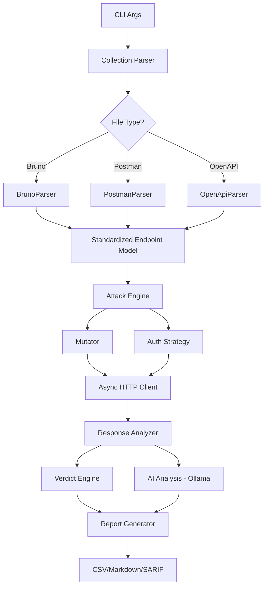

# ⚔️ BOLA-Fuzz: Automated Authorization Testing

> **A logic-aware API security tool built in Rust.** Automatically detects **Broken Object Level Authorization (BOLA/IDOR)** vulnerabilities by replaying Bruno, Postman, and OpenAPI collections with swapped session contexts.


## 🚀 The Problem

Traditional vulnerability scanners (like OWASP ZAP) struggle with **logic flaws**. They don't understand that User A *shouldn't* be able to see User B's data if the server returns a `200 OK`.

**BOLA-Fuzz** solves this by understanding your API's "ownership" context. It takes two valid user sessions and attempts to cross-pollinate their requests.

## ✨ Key Features

- **Zero-Config Discovery:** Parses your existing **Bruno** (`.bru`), **Postman** (`.json`), or **OpenAPI** (`.json`/`.yaml`) collections to find endpoints
- **Advanced OpenAPI Support:**
  - External `$ref` resolution (cross-file references)
  - `oneOf`, `allOf`, `anyOf` schema composition
  - Multiple content types (JSON, form-urlencoded, multipart, XML)
  - Nested and array request bodies
- **Logic-Aware Attacks:** Automatically identifies ID parameters (`:id`, `{userId}`) and swaps them with a victim's ID
- **Mutational Fuzzing:** Injects SQLi, XSS, and edge-case payloads into parameters
- **High Performance:** Built on **Tokio** to run thousands of async checks without blocking
- **AI-Powered Analysis:** Optional local LLM (Ollama) for PII detection and soft-fail analysis
- **CI/CD Ready:** Returns exit code `1` on vulnerabilities to block insecure Pull Requests
- **Multiple Report Formats:** CSV, Markdown, and SARIF output

## 🛠️ Installation

### From Source
```bash
git clone https://github.com/abendrothj/Doppel.git
cd Doppel
cargo build --release
```

### Prerequisites
- Rust 1.75 or higher
- (Optional) Ollama for local AI analysis

## 📖 Usage

### Basic Usage

Run the fuzzer against your local or staging API:

```bash
./target/release/bola_fuzz \
  --input "./api-specs/openapi.json" \
  --base-url "http://localhost:3000" \
  --attacker-token "eyJhbGc..." \
  --victim-id "user_123"
```

### Input Format Support

**OpenAPI/Swagger:**
```bash
./target/release/bola_fuzz \
  --input "./docs/openapi.json" \
  --base-url "https://api.example.com" \
  --attacker-token "$ATTACKER_TOKEN" \
  --victim-id "victim_456"
```

**Bruno Collections:**
```bash
./target/release/bola_fuzz \
  --input "./bruno" \
  --base-url "http://localhost:3000" \
  --attacker-token "$ATTACKER_TOKEN" \
  --victim-id "victim_456"
```

**Postman Collections:**
```bash
./target/release/bola_fuzz \
  --input "./postman_collection.json" \
  --base-url "http://localhost:3000" \
  --attacker-token "$ATTACKER_TOKEN" \
  --victim-id "victim_456"
```

### Advanced Options

```bash
./target/release/bola_fuzz \
  --input "./openapi.json" \
  --base-url "https://staging-api.example.com" \
  --attacker-token "$ATTACKER_TOKEN" \
  --victim-id "victim_456" \
  --no-mutational-fuzzing \    # Disable payload injection
  --no-pii-analysis \           # Disable AI-based PII detection
  --no-soft-fail-analysis \     # Disable error message detection
  --csv-report \                # Generate CSV report
  --markdown-report \           # Generate Markdown report
  --pdf-report                  # Generate PDF report (experimental)
```

## 🏗️ Architecture

The tool is designed with a plugin-based architecture for extensibility:



## 🔬 OpenAPI Advanced Features

### External File References

BOLA-Fuzz supports external `$ref` resolution across files:

```json
{
  "paths": {
    "/users": {
      "post": {
        "requestBody": {
          "content": {
            "application/json": {
              "schema": {
                "$ref": "./schemas/user.json#/definitions/User"
              }
            }
          }
        }
      }
    }
  }
}
```

### Schema Composition

Handles `oneOf`, `allOf`, and `anyOf` schemas:

```json
{
  "schema": {
    "oneOf": [
      {"$ref": "#/components/schemas/CreditCard"},
      {"$ref": "#/components/schemas/BankTransfer"}
    ]
  }
}
```

All properties from all schema variants are extracted and tested.

### Multiple Content Types

Supports various request body formats:
- `application/json`
- `application/x-www-form-urlencoded`
- `multipart/form-data`
- `application/xml`
- `text/plain`

### Nested and Array Bodies

Handles complex nested structures and array properties:

```json
{
  "schema": {
    "type": "object",
    "properties": {
      "orderId": {"type": "string"},
      "items": {
        "type": "array",
        "items": {"type": "string"}
      }
    }
  }
}
```

Generates parameters: `body.orderId`, `body.items[0]`

## 🧪 Testing

Run the comprehensive test suite:

```bash
# Run all tests
cargo test

# Run unit tests only
cargo test --test unit

# Run with verbose output
cargo test -- --nocapture
```

### Test Coverage

- ✅ Mutator fuzzing payloads
- ✅ Parameter substitution (nested objects)
- ✅ Authentication header injection
- ✅ OpenAPI local `$ref` resolution
- ✅ OpenAPI external file `$ref` resolution
- ✅ `oneOf`/`allOf`/`anyOf` schema handling
- ✅ Array request bodies
- ✅ Nested array properties
- ✅ Multiple content types

**Current Status:** 10/10 tests passing ✅

## 📊 Example Report

### Markdown Report (`bola_fuzz_report.md`)

```markdown
# BOLA-Fuzz Security Report

## Summary
- Total Endpoints Tested: 15
- Vulnerabilities Found: 2
- Secure Endpoints: 10
- Uncertain Results: 3

## Vulnerabilities

### 🚨 GET /api/users/{id}
- **Status:** VULNERABLE
- **Payload:** victim_user_123
- **Response:** 200 OK
- **Issue:** Attacker successfully accessed victim's user profile

### 🚨 GET /api/transactions/{transactionId}
- **Status:** VULNERABLE
- **Payload:** txn_456_victim
- **Response:** 200 OK
- **Issue:** Horizontal privilege escalation detected
```

### CSV Report (`bola_fuzz_report.csv`)

```csv
Endpoint,Payload,Verdict
GET /api/users/{id},victim_123,VULNERABLE
GET /api/accounts/{accountId},acc_789,SECURE
POST /api/payments,payment_data,UNCERTAIN
```

## 🔄 CI/CD Integration

### GitHub Actions

```yaml
name: BOLA Security Scan

on: [pull_request]

jobs:
  security-test:
    runs-on: ubuntu-latest
    steps:
      - uses: actions/checkout@v3

      - name: Install Rust
        uses: actions-rs/toolchain@v1
        with:
          toolchain: stable

      - name: Run BOLA-Fuzz
        run: |
          cd security/bola_fuzz
          cargo build --release
          ./target/release/bola_fuzz \
            --input ../../docs/openapi.json \
            --base-url ${{ secrets.STAGING_URL }} \
            --attacker-token ${{ secrets.TEST_ATTACKER }} \
            --victim-id ${{ secrets.TEST_VICTIM }}

      - name: Upload Report
        uses: actions/upload-artifact@v3
        with:
          name: security-report
          path: security/bola_fuzz/bola_fuzz_report.md
```

### Pre-commit Hook

```bash
#!/bin/bash
# .git/hooks/pre-commit

cd security/bola_fuzz
cargo run -- \
  --input ../../docs/openapi.json \
  --base-url http://localhost:3000 \
  --attacker-token "$ATTACKER_TOKEN" \
  --victim-id "test_victim"

if [ $? -ne 0 ]; then
  echo "❌ BOLA vulnerabilities detected!"
  exit 1
fi
```

## 📦 Roadmap

- [x] **Phase 1:** Bruno & Postman Collection Parsing
- [x] **Phase 2:** OpenAPI/Swagger Support with advanced $ref handling
- [x] **Phase 3:** Multi-threaded Attack Engine (Tokio async)
- [x] **Phase 4:** Mutational Fuzzing (SQLi, XSS payloads)
- [x] **Phase 5:** oneOf/allOf/anyOf schema support
- [x] **Phase 6:** External file $ref resolution
- [x] **Phase 7:** Multiple content type support
- [x] **Phase 8:** Comprehensive test suite
- [ ] **Phase 9:** SARIF Output for GitHub Security integration
- [ ] **Phase 10:** Enhanced AI-assisted anomaly detection
- [ ] **Phase 11:** Custom rule engine
- [ ] **Phase 12:** Web dashboard for results visualization

## 🔒 Privacy & Security

BOLA-Fuzz defaults to using a local LLM (Ollama) for any PII or sensitive-data analysis.

**Important:**
- Never run against production APIs without explicit authorization
- Use synthetic test data only
- Local AI analysis by default (no data sent to external services)
- Do not configure remote LLMs with real production data unless you have explicit consent and compliance approvals

## 🤝 Contributing

Contributions are welcome! Please follow these steps:

1. Fork the repository
2. Create a feature branch (`git checkout -b feature/amazing-feature`)
3. Run tests (`cargo test`)
4. Commit your changes (`git commit -m 'Add amazing feature'`)
5. Push to the branch (`git push origin feature/amazing-feature`)
6. Open a Pull Request

### Development Setup

```bash
# Clone the repo
git clone https://github.com/abendrothj/Doppel.git
cd Doppel

# Install dependencies
cargo build

# Run tests
cargo test

# Run with debug output
RUST_LOG=debug cargo run -- --input test.json --base-url http://localhost:3000 --attacker-token token --victim-id victim
```

## 📄 License

This project is licensed under the MIT License - see the LICENSE file for details.

## 🙏 Acknowledgments

- OWASP API Security Project
- Rust async ecosystem (Tokio, Reqwest)
- OpenAPI Specification contributors

## 📞 Support

- Issues: [GitHub Issues](https://github.com/abendrothj/Doppel/issues)
- Discussions: [GitHub Discussions](https://github.com/abendrothj/Doppel/discussions)
- Security: Please report security issues privately to contact@jakea.net

---

**Built with ❤️ in Rust for the security community**
